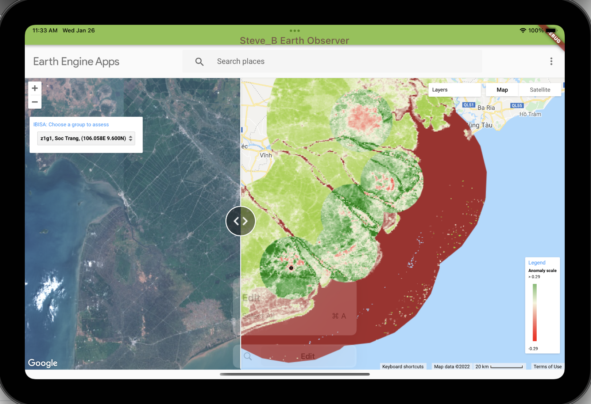

# Steve_B Earth Observer
## Introduction
I visited some friends in Goshen, Indiana, USA, in 1991. I met there a group of Amish people. The head of the group could forecast the weather of the coming week quite accurately, although he had no meteorological academic background. He simply had a long observation experience, as a farmer. His friends even say that he could predict pretty well the yield of the coming season.

In the same line, I'm convinced that if people were given simple tools to observe satellite images they can build their own knowledge, and if they can share this knowledge among them, together they can anticipate on potential weather changes for their families.

With the technologies available in the 21st century, this is possible:
* **Google Earth Engine** brings free and up-to-date satellite images as well as powerful image processing tools.
* **Flutter** or **React Native** supports making mobile apps for Android and iOS.
* **Blockchain** tools can be used to share in a decentralised and trusted manner each one's analysis, and build up individual reputation, as in the Amish community.

In the honor of *Steve Birky*, my brother-in-law, who spent his life helping people in need, this is a mobile-based tool to observe by satellite the health of vegetation everywhere in the world.

## How to use the mobile app
* Android devices: Download from Play Store at <URL>
* iOS devices: download from App Store at <URL>

This is an example on an iPad mini 6" screen: 

* by default the app shows the Mekong delta in Vietnam,
* click on "Search places" to go anywhere in the world,
* click the image and drag to move the area that is displayed, 
* the image is divided in 2 panes; click and drag the icon "<>" to change how the screen estate is shared between the 2,
  * the left pane shows the satellite image taken by Copernicus on a desired date
  * the right pane shows the Google data in several layers: map view, aerial view, vegetation view
* on top left you have the zoom button. Click on "+" to zoom in. Click on "-" to zoom in.

## Contents of this repository
This is a Flutter project, compatible Android and iOS.

More ...
